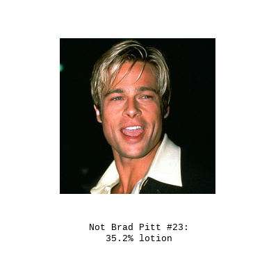

# DNN Adversarial Attacks of Resnet50 1001

I have been experimenting with DDN adversarial attacks and adding extra classes to a ResNet50 with almost no retrain.

The idea is to retrain a image classifier to add an extra category (the target category) so we are able to generate [adversarial images](https://en.wikipedia.org/wiki/Adversarial_machine_learning).

This is a paritcular case in which our model recognizes a Brad Pitt image as a lotion.

Finally I minted some of this images as NFTs on [hicetnunc](https://www.hicetnunc.xyz). And actually I sold some of them, LOL.
You can checkout some of the images [here](https://www.hicetnunc.xyz/tz/tz1Q54FD1ooX8oo37XK29DCn3wCdpwxow223).

__In this series of notebooks you will find:__

### Dataset creation
[aux_check_images_integrity.ipynb](./notebooks/aux_check_images_integrity.ipynb): In this notebook I download all the raw images of ImageNet 1000 and images of Brad Pitt from Public Figures Face Database.

The Idea is to recreate ImageNet 1000 dataset and an extra category (Bradley) that is the one that we will attack.

### Generate a ResNet50 1001

[retrain_ResNet1000_to_BradResnet1001.ipynb](./notebooks/retrain_ResNet1000_to_BradResnet1001.ipynb):

In this notebook I download a pretrained ResNet50 on ImageNet 1000. The idea is to make a ResNet50 1001, that perform as well on the 1000 of ImageNet as on the Brad Pitt images. This is the net that we are going to try to fool.

The idea is to generate a ResNet50 1001 with the minimum possible effort.

We first use the backbone of ResNet50 to train a classifier of Brad Pitt images (B net).

We then merge our trained single class DNN network trained with Brad images (B network) and the pretrained ResNet 50 1000 to produce a new model with 1001 outputs.

I hope that this model is as good as ResNet to identify ImageNet objects but also able to detect Bradley correctly.

Although I don't have any proof, since we are stacking [1000] and [1] arrays of output neurons that were trained with the same BackBone, I think that with a softmax output  this model will work well in the Image Net and Brad cases.

- When the network receives a Imagenet image, the Resnet1000 will produce a strong signal at the output that due to the softmax layer it will mute any Brad output. (B network was trained with ImageNet images as well as 0 classes)
- When the network receives a Brad Image, the B network will produce a strong output that will mute any output of the Resnet. Here the hypothesis and the Leap of faith is that although Resnet was not trained with Brad images, the outputs of the Resnet images won't compete with the output of the B. Net. There are some particular cases in which this may happen anyway: For example when there is an image of Brad Pitt with a suit.
So there might be some problems of overlapping of classes in the images:

- On way to avoid this would be to select Bradley images only of his face without any object present in ImageNet dataset.
- Another option that needs less manual processing is just retrain the whole stuff and beg for some DNNs magic (this is the chosen one)

### Generate adversarial samples

[generete_multiple_addversarial_attacks_and_export_nicely___massive_not_brads.ipynb](notebooks/generete_multiple_addversarial_attacks_and_export_nicely___massive_not_brads.ipynb)

Lastly we use a DNN attack that let us select the target category, and is better in terms of L2 norm compared to the Carlini and Wagner attack and is faster.

By target category I mean that we take a Bradley sample and we target it to be recognized as a bikini for example.

I frist try to code some L2 by self, but the results were not as good as I expected (you can check them out on /tests). So finally I use the DNN attack implemented in fooblbox.

- [foolbox](https://github.com/bethgelab/foolbox),
- [DNN attack - Decoupling Direction and Norm for Efficient Gradient-Based L2 Adversarial Attacks and Defenses ](https://arxiv.org/abs/1811.09600),
